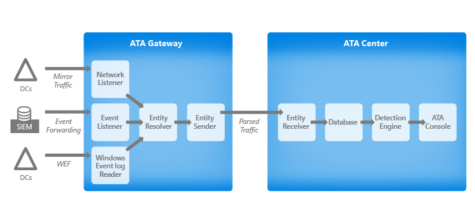

# This is Johnney's A/B Testing Page A

# ATA Architecture
The Advanced Threat Analytics architecture is detailed in this diagram:

ATA has two main components - the ATA Gateway and the ATA Center.

These connect to your existing network by mirroring the network traffic to and from your domain controllers, and by looking at Windows events (forwarded directly from the domain controllers or from a SIEM server) and analyzing the data for attacks and threats.

This section describes the flow of network capturing and processing and drills down into the main components of the ATA Gateway and the ATA Center and their functionality.

## ATA Components
ATA consists of the following:

- One or more ATA Gateways

- One ATA Center
